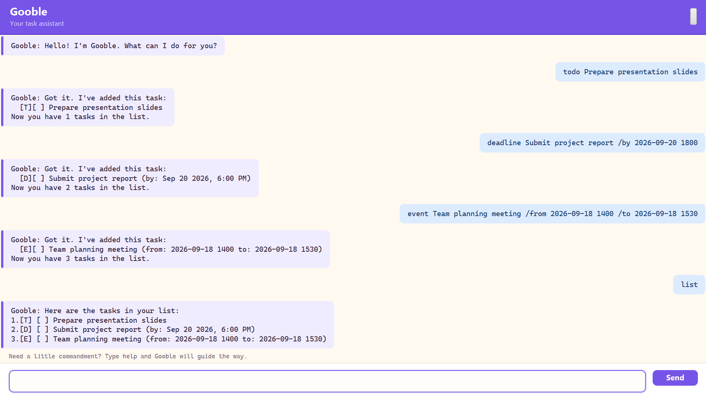

# Gooble User Guide

Gooble is a task assistant for managing **to-dos, deadlines, events, and tags**.
It provides a **JavaFX graphical user interface (GUI)** and a
**command-line interface (CLI)**, so you can manage tasks either by clicking
or typing.



## Contents

- [Quick start](#quick-start)
- [Features](#features)
  - [Command format](#command-format)
  - [Command summary](#command-summary)
  - [Viewing help: `help`](#viewing-help-help)
  - [Adding a task: `add` and `todo`](#adding-a-task-add-and-todo)
  - [Adding a deadline: `deadline`](#adding-a-deadline-deadline)
  - [Adding an event: `event`](#adding-an-event-event)
  - [Viewing tasks: `list`](#viewing-tasks-list)
  - [Finding tasks: `find`](#finding-tasks-find)
  - [Completing tasks: `mark` and `unmark`](#completing-tasks-mark-and-unmark)
  - [Deleting a task: `delete`](#deleting-a-task-delete)
  - [Managing tags: `tag` and `untag`](#managing-tags-tag-and-untag)
  - [Exiting Gooble: `bye`](#exiting-gooble-bye)
- [Saving your tasks](#saving-your-tasks)
- [Error handling](#error-handling)
- [FAQ](#faq)
- [Building and testing](#building-and-testing)

## Quick start

### **Prerequisites**

- JDK 25
- IntelliJ IDEA, if you are running the project from the IDE

### **Run the GUI**

From the project directory, run:

```powershell
.\gradlew.bat run
```

The Gooble window opens with a command box at the bottom. Type a command and
press **Enter** or click **Send**. Type `bye` to display the goodbye message
and close the GUI window.

### **Run the CLI**

Run the `gooble.Gooble` main class from IntelliJ, or use:

```powershell
.\gradlew.bat classes
java -cp build\classes\java\main gooble.Gooble
```

Type a command when prompted. Type `bye` to end the CLI session.

### **Try these commands**

The following sequence demonstrates the main task types:

```text
todo Prepare presentation slides
deadline Submit project report /by 2026-09-20 1800
event Team planning meeting /from 2026-09-18 1400 /to 2026-09-18 1530
tag 1 #school
list
```

## Features

### **Command format**

- **Required values:** Text in `<angle brackets>` is a value that you replace.
  For example, replace `<description>` with `prepare presentation`.
- **Optional values:** Text in `[square brackets]` may be omitted.
  For example, `help [command]` can be written as either `help` or
  `help deadline`.
- **Task numbers:** `<number>` refers to the task number shown by `list` or
  `find`.
- **Date and time:** Dates use `yyyy-MM-dd`. Times use the 24-hour format
  `HHmm`.

### Command summary

| Command | Purpose | Example |
| --- | --- | --- |
| `add <description>` | Add a simple task | `add read chapter 3` |
| `todo <description>` | Add a to-do task | `todo prepare presentation` |
| `deadline <description> /by <date>` | Add a deadline | `deadline submit report /by 2026-09-20 1800` |
| `event <description> /from <start> /to <end>` | Add an event | `event team meeting /from 2026-09-18 1400 /to 2026-09-18 1530` |
| `list` | Show all tasks | `list` |
| `list from <start> to <end>` | Show events in a period | `list from 2026-09-18 0000 to 2026-09-19 2359` |
| `find <keyword>` | Find tasks by description or tag | `find report` |
| `mark <number>` | Mark a task as complete | `mark 2` |
| `unmark <number>` | Mark a task as incomplete | `unmark 2` |
| `delete <number>` | Delete a task | `delete 2` |
| `tag <number> #<tag>` | Add a tag | `tag 1 #school` |
| `untag <number>` | Remove all tags | `untag 1` |
| `help [command]` | Show help | `help deadline` |
| `bye` | Exit Gooble | `bye` |

> **Tip:** Task numbers refer to the positions shown by the latest `list` or
> `find` result.

### Viewing help: `help`

Shows the available commands and their formats.

**Format:**

```text
help [command]
```

**Examples:**

- `help` shows the complete command guide.
- `help deadline` shows a detailed deadline example.

### Adding a task: `add` and `todo`

`add` creates a simple task. `todo` creates a to-do task with a `T` type
marker.

**Format:**

```text
add <description>
todo <description>
```

**Examples:**

```text
add Read chapter 3
todo Prepare presentation slides
```

### Adding a deadline: `deadline`

Creates a task with a **due date** and optional time.

**Format:**

```text
deadline <description> /by <date> [time]
```

**Examples:**

```text
deadline Submit project report /by 2026-09-20 1800
deadline Return library books /by 2/12/2019 1800
```

> **Date formats:** Gooble accepts `yyyy-MM-dd`, optionally followed by a
> time, or `d/M/yyyy HHmm`.

It also displays seasonal greetings for supported dates such as Valentine's
Day and recognized Chinese New Year dates.

### Adding an event: `event`

Creates an event with a start and end date or time.

**Format:**

```text
event <description> /from <start> /to <end>
```

**Example:**

```text
event Team planning meeting /from 2026-09-18 1400 /to 2026-09-18 1530
```

> **Important:** The event end must be later than its start.

### Viewing tasks: `list`

Displays every task in the current task list. Task numbers in this output are
used by commands such as `mark 2` and `delete 2`.

**Format:**

```text
list
```

To show only events within a **date-time range**, use:

```text
list from <start> to <end>
```

For example:

```text
list from 2026-09-18 0000 to 2026-09-19 2359
```

> **Important:** The event must be fully contained within the requested range.

### Finding tasks: `find`

Searches task descriptions and tags. The search is case-insensitive and keeps
matching tasks in their original order.

**Format:**

```text
find <keyword>
```

**Examples:**

- `find report` finds tasks whose descriptions contain `report`.
- `find #school` finds tasks with the `school` tag.

### Completing tasks: `mark` and `unmark`

Changes the completion status of a task.

**Format:**

```text
mark <number>
unmark <number>
```

`mark 1` marks the first task as complete. `unmark 1` changes it back to
incomplete.

> **Tip:** Run `list` first if you are unsure which number to use.

### Deleting a task: `delete`

Removes a task from the list.

**Format:**

```text
delete <number>
```

**Example:**

```text
delete 2
```

### Managing tags: `tag` and `untag`

Adds or removes tags from a task.

**Format:**

```text
tag <number> #<tag>
untag <number>
```

**Examples:**

```text
tag 1 #School
untag 1
```

> **Tag rules:** Tags are normalized to lowercase and may contain letters,
> numbers, hyphens, and underscores. Each task can have at most three tags.
> Adding a fourth tag removes the oldest tag.

`find` can search for tags as well as descriptions.

### Exiting Gooble: `bye`

Ends the current session.

**Format:**

```text
bye
```

> **GUI:** The goodbye message is displayed before the window closes.
>
> **CLI:** The command loop ends after the goodbye message.

## Saving your tasks

Gooble automatically saves changes to `data/Gooble.txt`. Tasks are restored
from this file when Gooble starts, so they remain available between sessions.

> **Storage location:** The file is relative to the folder from which Gooble
> is launched.

The storage folder and file are created automatically when the first task is
saved.

## Error handling

Gooble rejects invalid input with a helpful message instead of adding an
incorrect task or crashing.

**Common errors include:**

- Missing descriptions, such as `todo` or `add` without text.
- Unknown commands, such as `dance`.
- Missing or invalid task numbers.
- Invalid deadline or event date-time formats.
- Event ranges where the end is earlier than the start.
- Invalid tags such as `#school!` or commands containing multiple tags.
- Duplicate tasks with the same details.

When an error occurs, read the displayed message and use `help <command>` for
the correct format.

**Example: unknown command**

```text
Invalid command. Gooble is confused, but not offended. Type help to see what I understand.
```

## FAQ

### **Where are my tasks stored?**

Tasks are stored in `data/Gooble.txt` relative to the folder from which Gooble
is launched.

### **Why does a task number not work?**

Task numbers refer to the most recently displayed list. Run `list` or `find`
again and use a number from that output.

### **How do I learn a command's exact format?**

Run `help` for all commands or `help <command>` for one command, such as
`help event`.

### **How do I close the GUI?**

Enter `bye`. Gooble displays the goodbye message and closes the window.

## Building and testing

**Build the distributable fat JAR:**

```powershell
.\gradlew.bat clean shadowJar
```

The output is `build\libs\Gooble.jar`. It launches the JavaFX GUI when run
with:

```powershell
java -jar Gooble.jar
```

To run the CLI directly during development, use the `gooble.Gooble` main class
from IntelliJ or run:

```powershell
.\gradlew.bat classes
java -cp build\classes\java\main gooble.Gooble
```

**Run the automated tests and Checkstyle checks:**

```powershell
.\gradlew.bat check
```

The detailed test report is generated at
`build\reports\tests\test\index.html`. The complete command-line test
scenarios are documented in `test\ui-test-plan.md`.
